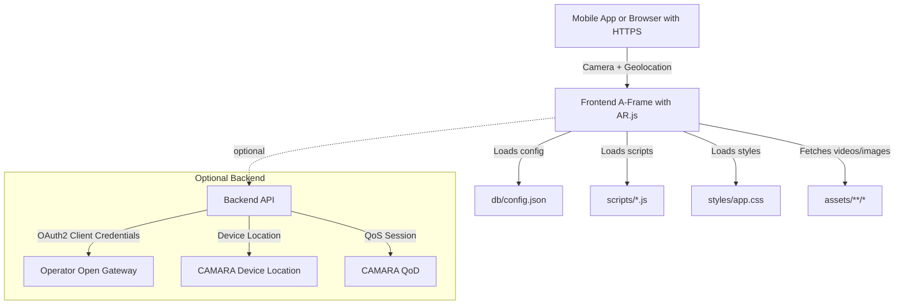

# Echoes of Eternity AR

A mobile-first web AR experience that overlays historical videos when users point their camera at real-world posters or arrive at iconic locations. Built for the Telstra Hackathon to demonstrate telco-integrated AR using operator network capabilities: device location and Quality-on-Demand.

## Why
- Tourism needs delightful, low-friction experiences that connect people to places. This app turns landmarks and venue posters into living guides, playing short historical clips in AR.
- For operators and tourism boards, it showcases how network-verified location and on-demand network quality can elevate reliability and user experience beyond GPS and best-effort mobile data.

## Key Features
- Marker-based AR: Recognizes NFT markers (e.g., MCG, Uluru) and plays associated videos precisely aligned to the image.
- Location-based AR: Automatically shows the same videos when the user is physically at those destinations.
- Mobile optimized: Portrait-friendly, muted autoplay compliance, and responsive UI.
- Lazy media loading: Videos download only after a marker is detected or the user enters the geo-radius.

## Telstra Hackathon + CAMARA APIs (GSMA Open Gateway)
This prototype is designed to integrate with operator network capabilities via CAMARA APIs:
- Device Location API: Obtain network-verified device location (with user consent), improving accuracy and indoor availability versus GPS.
- Quality on Demand (QoD) API: Temporarily enhance network performance (latency/jitter/bandwidth) for the AR video stream during short sessions.

Notes:
- Availability of CAMARA APIs depends on the user’s mobile operator and region.
- These APIs should be called from a secure backend with OAuth2 (client credentials) against the operator’s Open Gateway.
- The current frontend includes a dummy REST call placeholder to illustrate the “request video download/QoD” trigger when a marker is detected.

## Simple Architecture

- Frontend (this repo):
  - Static site (index.html) delivered via GitHub Pages/HTTPS.
  - A-Frame + AR.js for both NFT (image) and geo AR experiences.
  - Config-driven content from `db/config.json` (NFT base URLs, video URLs, geo coordinates, trigger radius, dimensions/pose).
  - JS and CSS loaded from `scripts/` and `styles/` for Pages-friendly hosting.
- Backend (optional, not included):
  - Minimal server exposing:
    - POST /api/network-location → calls CAMARA Device Location (with consent).
    - POST /api/qod/start and /api/qod/stop → creates/releases QoD sessions around video playback.
  - Stores consent and session metadata (short-lived).

### Runtime Flow
1) Page loads → camera permission requested (HTTPS only).
2) When an NFT marker is seen:
   - Video source is set lazily and playback starts.
   - A dummy REST call is fired (placeholder for CAMARA/QoD initiation).
3) When the user is within a configured geo-radius (e.g., at Uluru/MCG):
   - The corresponding AR video is shown above the location anchor.
   - Hysteresis and smoothing reduce flicker/jitter.

## Local Development
- Serve over HTTPS (browsers require it for camera/geolocation).
- Recommended: GitHub Pages or a local HTTPS dev server.
- Assets are referenced with project-relative paths for Pages compatibility.
- for local dev development use `./start-server.sh`

## Deploying to GitHub Pages
- This repo includes a GitHub Actions workflow at `.github/workflows/deploy-pages.yml`.
- Push to `main` → the site auto-deploys to GitHub Pages.
- Settings → Pages → Source: GitHub Actions.

## Future Improvements
- Backend integration with Telstra Open Gateway (CAMARA): real Device Location and QoD flows with OAuth2 tokens.
- Consent UX: explicit, friendly flows explaining data usage and QoD sessions.
- Offline/Lite mode: progressive fallback when connectivity is poor.
- Analytics: anonymized engagement and QoS metrics for tourism stakeholders.
- Content management: a simple CMS or headless backend to update locations, videos, and marker packs.
- Multi-language subtitle and audio tracks.
- On-device stabilization: more aggressive smoothing, plane anchors, and pose estimation refinements.

## Credits
### AR library from:
    - AR.js : https://ar-js-org.github.io/AR.js-Docs/

### Images obtained from:
- Uluru: https://upload.wikimedia.org/wikipedia/commons/a/a8/ULURU.jpg
- Uluru: https://upload.wikimedia.org/wikipedia/commons/0/0d/UluruClip3ArtC1941.jpg
- MCG: https://www.austadiums.com/stadiums/photos/MCG-boxing-day-test-23.jpg

### Video Obtained From:
- The Geologic Oddity in Australia; Uluru / Ayers Rock: https://www.youtube.com/watch?v=6gnGWyEFN9w
- Don Bradman's 100th Century :: SCG, 1947 : https://www.youtube.com/watch?v=6su2wBV60Gg

### NFT created using:
- https://carnaux.github.io/NFT-Marker-Creator/#/