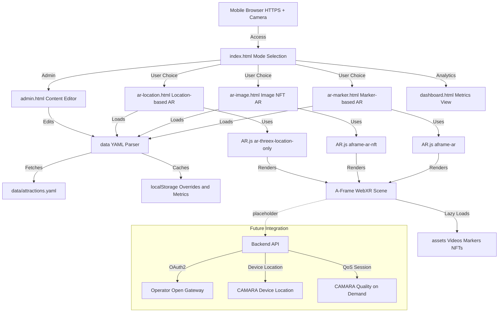

# 🌏 Echoes of Eternity AR

> **A mobile-first web AR experience that brings history to life** — Point your camera at iconic landmarks or venue posters to unlock immersive historical video content, powered by telco network capabilities.

Built for the **Telstra Hackathon** to demonstrate how operator network capabilities (Device Location and Quality-on-Demand) can elevate AR experiences beyond traditional GPS and best-effort mobile data.

---

## 🎯 Problem Statement

Tourism experiences often lack the depth and engagement needed to truly connect visitors with historical significance. Traditional audio guides and static signage fall short of creating memorable, interactive experiences. Meanwhile, mobile networks have untapped potential to provide enhanced location accuracy and guaranteed quality of service for rich media experiences.

**Echoes of Eternity AR** solves this by:
- **Transforming static landmarks into living history** — Posters and monuments become interactive portals to the past
- **Leveraging network intelligence** — Using operator-verified location and on-demand network quality for superior reliability
- **Creating zero-friction experiences** — No app downloads, works directly in mobile browsers with camera access

---

## ✨ Key Features

### 🎬 Multi-Modal AR Detection
- **Marker-Based AR**: Recognizes NFT markers (e.g., MCG, Uluru) and plays associated videos with precise image alignment
- **Location-Based AR**: Automatically triggers content when users arrive at configured destinations
- **Image NFT Tracking**: Advanced image recognition for flexible marker deployment

### 📱 Mobile-First Design
- **Portrait-Optimized**: Designed for natural mobile phone usage
- **Responsive UI**: Seamless experience across device sizes
- **Muted Autoplay Compliance**: Respects browser policies while maintaining engagement

### ⚡ Performance Optimized
- **Lazy Media Loading**: Videos download only after detection, reducing initial load time
- **Efficient Resource Management**: Config-driven content loading from YAML/JSON
- **Smooth Tracking**: Hysteresis and smoothing algorithms reduce flicker and jitter

---

## 🚀 Telstra Hackathon Integration

This prototype demonstrates integration with **CAMARA APIs (GSMA Open Gateway)** to showcase operator network capabilities:

### 📍 Device Location API
- **Network-Verified Location**: Obtains operator-verified device location with user consent
- **Enhanced Accuracy**: Superior to GPS, especially in indoor environments
- **Privacy-First**: Explicit consent flows and secure backend integration

### 🎯 Quality on Demand (QoD) API
- **Dynamic Network Enhancement**: Temporarily boosts network performance (latency, jitter, bandwidth)
- **Session-Based**: Activates during AR video playback for guaranteed quality
- **Automatic Management**: Seamless start/stop around media sessions

> **Note**: CAMARA API availability depends on the user's mobile operator and region. Integration requires a secure backend with OAuth2 (client credentials) against the operator's Open Gateway.

---

## 🏗️ Architecture



### Frontend Architecture

#### **Entry Point & Navigation**
- **`index.html`**: Main landing page with AR mode selection (Marker, Image NFT, Location)
- **`view/`**: Dedicated HTML pages for each AR mode and admin tools
  - `ar-marker.html`: Pattern/barcode marker detection
  - `ar-image.html`: Image NFT tracking
  - `ar-location.html`: GPS-based geofencing
  - `admin.html`: YAML/JSON content editor
  - `dashboard.html`: Analytics and metrics visualization

#### **Core Scripts**
- **`data.js`**: 
  - Loads and parses `data/attractions.yaml` using js-yaml
  - Manages localStorage overrides for admin edits
  - Provides distance calculation utilities (Haversine formula)
- **`app.js`**: Shared utility functions (querySelector helpers)
- **`metrics.js`**: LocalStorage-based analytics tracking
- **AR-specific scripts**:
  - `ar-marker.js`: Marker detection and video playback logic
  - `ar-image.js`: NFT marker tracking and content overlay
  - `ar-location.js`: GPS-based attraction triggering with radius checks

#### **AR Framework Stack**
- **A-Frame 1.6.0**: WebXR framework for 3D scene rendering
- **AR.js 3.4.7**: 
  - `aframe-ar.js`: Marker-based tracking (Hiro, Kanji, custom patterns, barcodes)
  - `aframe-ar-nft.js`: Image recognition and NFT marker tracking
  - `ar-threex-location-only.js`: GPS camera and location-based entity placement

#### **Data Flow**
1. **Configuration**: YAML file defines attractions with AR type, coordinates, videos, markers
2. **Loading**: `data.js` fetches YAML, applies localStorage overrides if present
3. **Initialization**: AR pages load attractions and dynamically create A-Frame entities
4. **Detection**: AR.js tracks markers/GPS and triggers video loading
5. **Playback**: Videos lazy-load only when targets are detected or user enters geofence
6. **Analytics**: Metrics recorded to localStorage for dashboard visualization

### Backend Integration (Future)
- **CAMARA APIs**: Placeholder for operator network capabilities
  - Device Location API: Network-verified positioning
  - Quality on Demand API: Enhanced network performance during AR sessions
- **Implementation**: Requires secure backend with OAuth2 client credentials
- **Current State**: Frontend includes hooks for future API integration

---

## 📊 Data Model

Attractions are defined in `data/attractions.yaml` with support for multiple AR types:

```yaml
- id: mcg-australia
  name: Melbourne Cricket Ground
  type: marker  # marker | imageNFT | location
  marker:
    preset: null
    patternUrl: "assets/markers/pattern-MCG_Australia.patt"
  location:
    latitude: -37.8199
    longitude: 144.9834
    radiusMeters: 100
  videoUrl: "assets/videos/Sir-Don-Bradman_100-Century_SCG_15-11-1947.mp4"
  thumbnail: "images/MCG_Australia.jpg"
  city: "Melbourne"
  description: "Experience Don Bradman's historic 100th century at the SCG"
```

### Supported AR Types
- **`marker`**: Pattern-based markers (Hiro, Kanji, custom patterns, or barcode)
- **`imageNFT`**: Image recognition using NFT markers
- **`location`**: GPS-based geofencing with configurable radius

---

## 🚀 Quick Start

### Prerequisites
- Modern mobile browser with camera access (Chrome, Safari, Firefox)
- HTTPS connection (required for camera/geolocation APIs)
- Python 3.x (for local development server)

### Local Development

1. **Clone the repository**
   ```bash
   git clone <repository-url>
   cd aeterna
   ```

2. **Start the HTTPS development server**
   ```bash
   ./start-server.sh
   ```
   Or manually:
   ```bash
   python3 serve_https.py
   ```

3. **Access the application**
   - Open `https://localhost:8443` on your mobile device
   - Accept the self-signed certificate warning
   - Grant camera and location permissions when prompted

### Runtime Flow

#### **Marker-Based AR** (`ar-marker.html`)
1. Page loads → Camera permission requested (HTTPS only)
2. `data.js` fetches `attractions.yaml` and loads attractions
3. For each attraction with marker config:
   - Creates A-Frame marker entity (preset, pattern, or barcode)
   - Creates video asset element (initially empty, `preload="none"`)
4. When marker detected:
   - `markerFound` event fires
   - Video source set lazily from `videoUrl`
   - Video playback starts automatically
   - Metrics recorded to localStorage

#### **Image NFT AR** (`ar-image.html`)
1. Page loads → Camera permission requested
2. Attractions with `imageNFT.nftBaseUrl` are loaded
3. For each attraction:
   - Creates `<a-nft>` element with NFT base URL
   - Creates video plane entity (initially hidden)
4. When image recognized:
   - `markerFound` event fires
   - Video loads from `videoUrl` (lazy loading)
   - Video plane becomes visible in AR scene
   - UI video overlay also plays

#### **Location-Based AR** (`ar-location.html`)
1. Page loads → Camera and geolocation permissions requested
2. Attractions with `location` coordinates are loaded
3. For each attraction:
   - Creates GPS entity with `gps-entity-place` component
   - Stores distance check function
4. GPS position updates trigger:
   - Haversine distance calculation for all attractions
   - If within `radiusMeters`: video loads and plays
   - Hysteresis prevents flickering at boundary edges
   - Last position cached in localStorage

---

## 📦 Deployment

### GitHub Pages (Recommended)

This repository includes automated deployment via GitHub Actions:

1. **Enable GitHub Pages**
   - Navigate to Settings → Pages
   - Set Source to "GitHub Actions"

2. **Automatic Deployment**
   - Push to `main` branch
   - Workflow at `.github/workflows/deploy-pages.yml` handles deployment
   - Site available at `https://<username>.github.io/aeterna`

### Custom HTTPS Server

For production deployment:
- Use a valid SSL certificate (Let's Encrypt recommended)
- Ensure all asset paths are relative for portability
- Configure CORS if needed for cross-origin requests

---

## 🛠️ Development Notes

### Permissions
- Camera and location permissions are requested only on AR pages (`ar-*.html`)
- Graceful degradation if permissions are denied
- Location-based AR requires both camera and geolocation permissions

### Data Management
- **Primary Source**: `data/attractions.yaml` defines all attractions
- **Local Overrides**: Admin interface can save edits to `localStorage` (`eternity.attractions.override`)
- **Format Support**: Admin supports both YAML and JSON import/export
- **Distance Calculations**: Uses Haversine formula for GPS-based proximity checks

### Media Loading
- **Lazy Loading**: Videos use `preload="none"` and `src` is set only after detection
- **Multiple Attractions**: All three AR modes support multiple attractions simultaneously
- **Asset Organization**: 
  - Videos: `assets/videos/`
  - Markers: `assets/markers/*.patt`
  - NFT markers: `assets/nfts/` (requires `.fset`, `.fset3`, `.iset` files)

### Analytics
- **Storage**: Metrics stored in `localStorage` (`eternity.metrics.v1`)
- **Tracking**: Page visits, attraction views, and video plays
- **Dashboard**: `dashboard.html` visualizes collected metrics

### Browser Compatibility
- **iOS Safari**: Full support (12.2+)
- **Android Chrome**: Full support
- **Desktop**: Limited (camera access required, primarily for testing)

---

## 🔮 Future Enhancements

### Short-Term
- [ ] Backend integration with Telstra Open Gateway (CAMARA)
- [ ] Explicit consent UX flows for location and QoD
- [ ] Analytics integration (PostHog/Google Analytics)

### Long-Term
- [ ] Offline/Lite mode with progressive fallback
- [ ] Multi-language subtitles and audio tracks
- [ ] Content Management System (CMS) integration
- [ ] Enhanced stabilization and pose estimation
- [ ] Anonymized engagement and QoS metrics dashboard

---

## 📚 Technology Stack

| Component | Technology |
|-----------|-----------|
| **AR Framework** | A-Frame 1.6.0 |
| **AR Tracking** | AR.js 3.4.7 |
| **Frontend** | Vanilla JavaScript, HTML5 |
| **Styling** | CSS3 (Mobile-First) |
| **Data Format** | YAML (with JSON support) |
| **Deployment** | GitHub Pages |
| **Server** | Python HTTPS Server |

---

## 🙏 Credits & Acknowledgments

### Open Source Libraries
- **[AR.js](https://ar-js-org.github.io/AR.js-Docs/)** — WebAR framework for marker and location tracking
- **[A-Frame](https://aframe.io/)** — WebXR framework for building VR/AR experiences
- **[NFT Marker Creator](https://carnaux.github.io/NFT-Marker-Creator/#/)** — Tool for generating NFT markers

### Media Sources
- **Uluru Images**: [Wikimedia Commons](https://upload.wikimedia.org/wikipedia/commons/a/a8/ULURU.jpg)
- **MCG Image**: [Austadiums](https://www.austadiums.com/stadiums/photos/MCG-boxing-day-test-23.jpg)
- **Uluru Video**: [The Geologic Oddity in Australia](https://www.youtube.com/watch?v=6gnGWyEFN9w)
- **MCG Video**: [Sir Don Bradman's 100th Century](https://www.youtube.com/watch?v=6su2wBV60Gg)

---

## 📄 License

This project is developed for the Telstra Hackathon. Please refer to individual component licenses for open-source dependencies.

---

## 🤝 Contributing

This is a hackathon project. For questions or suggestions, please open an issue or contact the development team.

---

**Built for the Telstra Hackathon**
